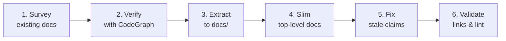

# Splitting and Verifying Docs

## Overview

**Core principle:** Documentation drift is silent. Counts, paths, and symbol names in prose rot while the code moves on. Use static analysis (CodeGraph) to verify every concrete claim, and extract detail-heavy sections into dedicated files so top-level docs stay scannable.

This is **doc refactoring with verification**, not just rewriting — information moves between files but is also checked against the codebase and corrected where wrong.

## When to Use

Use this skill when ANY of these are true:

- A top-level doc (AGENTS.md / CLAUDE.md / README.md) exceeds ~300 lines or mixes "quick reference" with "deep architecture"
- The doc contains concrete, verifiable claims (route counts, component counts, file lists, version numbers) that haven't been checked against source recently
- The project has multiple overlapping docs describing the same thing at different levels of detail (e.g., `AGENTS.md` + `docs/architecture.html` + `CLAUDE.md` all describing architecture)
- A new team member would struggle to find the authoritative source for architecture questions
- You're about to create or restructure architecture documentation

**Do NOT use for:**

- Adding new content that didn't exist before (that's writing, not refactoring)
- One-file fixes (just edit the file)
- Projects without CodeGraph indexed (`.codegraph/` absent) — fall back to manual `grep`/`list_dir` verification, which is slower

## Core Workflow



### Phase 1 · Survey existing docs

Read every top-level and `docs/` doc in parallel. Build a mental table:

| Doc | Length | Scope | Problem |
|---|---|---|---|
| `AGENTS.md` | ? lines | dev quick-start + architecture | bloat? detail-heavy? |
| `CLAUDE.md` | ? lines | Claude guide | overlaps with AGENTS.md? |
| `README.md` | ? lines | public intro | product-focused? |
| `docs/*.html` / `*.md` | ? | visual / deep dive | stale numbers? wrong title? |

**Identify:** which sections are "quick reference" (keep inline) vs "deep content" (extract to `docs/`).

### Phase 2 · Verify concrete claims with CodeGraph

**This is the heart of the skill.** For every number, path, and name the docs assert, cross-check against the actual codebase. Don't trust the docs.

| Claim type | How to verify |
|---|---|
| "N API routes" | `Get-ChildItem -Recurse -Filter "route.ts" \| Measure-Object` (PowerShell) or `find . -name route.ts \| wc -l` |
| "N components" | `list_dir components/` + `codegraph_search "kind:component"` |
| "N hooks" | `list_dir hooks/` (don't forget subdirectories like `agent-session/`) |
| File path exists | `list_dir` on the parent directory |
| Symbol still exists | `codegraph_search "SymbolName"` |
| Version number | `read_file package.json` |
| Component responsibilities | `codegraph_explore "ComponentName what it does"` |

**Common drift patterns to look for:**

- Counts that were accurate at one version but never updated (e.g., "14 components" when there are now 17)
- Renamed directories or files (docs still reference old names)
- New subdirectories the docs don't mention (e.g., `electron/` missing from file map)
- Upstream dependency version bumps not reflected (e.g., doc says `^0.75.5`, actual is `^0.78.0`)
- Project rename (e.g., doc title says "Pi Web" but package is now "pi-agent-desktop")

### Phase 3 · Extract detailed content to dedicated docs

For each "deep content" section identified in Phase 1:

1. **Create `docs/<TOPIC>.md`** (e.g., `docs/ARCHITECTURE.md`)
2. **Move the content verbatim** — don't rewrite, just relocate (easier to review diffs)
3. **Apply Phase 2 corrections** to the moved content
4. **Add structure** — table of contents, Mermaid diagrams, tables where lists were vague
5. **Mark as authoritative** — add a header note like "本文档是项目的权威架构参考"

**Naming convention:** `docs/ARCHITECTURE.md`, `docs/CONTRIBUTING.md`, `docs/DEPLOYMENT.md` — UPPERCASE for top-level project docs (matches GitHub convention and sorts above lowercase files).

### Phase 4 · Slim top-level docs

Replace the extracted sections in `AGENTS.md` / `CLAUDE.md` with:

1. **A 3-5 line "cheat sheet"** of the most frequently looked-up info
2. **A link** to the dedicated doc with anchor (e.g., `[docs/ARCHITECTURE.md §14](docs/ARCHITECTURE.md#14-关键设计决策与陷阱)`)

**What to keep inline in top-level docs:**

- Commands developers run daily (`npm run dev`, `npm test`)
- The 3-5 most common pitfalls (with link to full list)
- Directory-purpose table (one row per top-level dir)

**What to extract:**

- ASCII architecture diagrams
- Full file maps
- Complete API route listings
- Detailed design decision explanations
- Data flow sequence diagrams

### Phase 5 · Fix stale claims (from Phase 2)

Apply every correction discovered in Phase 2 to **both** the dedicated doc and any remaining references in top-level docs. Common fixes:

- Title / project name / version in HTML `<title>` and footer
- Counts in section headings ("14 个组件" → "17 个顶层组件 + 3 个子组件目录")
- Missing directories in file maps
- Outdated dependency versions in tech stack tables
- Wrong GitHub links

### Phase 6 · Validate

- **Markdown lint:** run `get_errors` on every changed `.md` file — fix MD040 (code block language) and other warnings
- **HTML lint:** run `get_errors` on changed `.html` files
- **Link integrity:** `grep_search` for any `docs/` paths referenced in top-level docs to confirm targets exist
- **CodeGraph staleness:** after edits, check for the "⚠️ Some files referenced below were edited" banner — re-read those specific files if it appears

## Quick Reference: Verification Cheatsheet

```powershell
# Count API routes (App Router)
Get-ChildItem -Path "app/api" -Recurse -Filter "route.ts" | Measure-Object

# List all components (including subdirectories)
Get-ChildItem -Path "components" -Recurse -Filter "*.tsx"

# Verify package versions
Get-Content package.json | Select-String "version"

# Find all SKILL.md locations the loader scans
node --input-type=module -e "import {getAgentDir, DefaultResourceLoader} from '@earendil-works/pi-coding-agent'; const l = new DefaultResourceLoader({cwd: process.cwd(), agentDir: getAgentDir()}); await l.reload(); l.getSkills().skills.forEach(s => console.log(s.filePath));"
```

For symbol-level verification, prefer CodeGraph MCP tools over grep:

- `codegraph_explore` — one call returns source + callers + blast radius
- `codegraph_search` — fast name → location lookup
- `codegraph_node` — single symbol depth (source + caller/callee trail)

## Common Mistakes

### 1. Extracting too aggressively

**Wrong:** Move everything out of `AGENTS.md`, leaving only a link.
**Right:** Keep the 5 things developers look up daily inline; extract the rest.

Test: "If a new dev opens `AGENTS.md` for the first time, can they start coding in 60 seconds?" If yes, the slim version is right.

### 2. Trusting doc counts without verification

**Wrong:** See "19 API routes" in docs, assume it's correct, copy it to the new doc.
**Right:** Run the count command. Docs almost always lag behind code.

### 3. Breaking existing anchor links

**Wrong:** Move content to a new file, leave `AGENTS.md#architecture` pointing at a section that no longer exists.
**Right:** When extracting, add a stub section in the old location with a redirect note, or update all inbound links.

### 4. Duplicating instead of relocating

**Wrong:** Copy architecture content to `docs/ARCHITECTURE.md` AND leave the full version in `AGENTS.md`.
**Right:** Move it. Replace the original location with a 3-line summary + link. Single source of truth.

### 5. Skipping HTML docs

**Wrong:** Only update `.md` files; assume `docs/architecture.html` is fine.
**Right:** HTML docs rot fastest (they're not in the edit loop). Verify titles, footers, version badges, and component counts in HTML too.

## Real-World Example

The `pi-agent-desktop` project went through this exact process in June 2026:

**Before:**

- `AGENTS.md`: ~350 lines mixing quick-start with ASCII architecture diagrams, full file map, and detailed traps
- `CLAUDE.md`: ~250 lines with overlapping architecture description
- `docs/architecture.html`: titled "Pi Web v0.6.11" (project was renamed to pi-agent-desktop v0.7.11)

**After:**

- `AGENTS.md`: ~150 lines — quick-start + 3-line architecture summary + link
- `CLAUDE.md`: ~100 lines — guide + 3 most-common pitfalls + link
- `docs/ARCHITECTURE.md`: 30KB authoritative doc with 15 sections, Mermaid diagrams, full tables
- `docs/architecture.html`: corrected title, version, 8 stale facts fixed via CodeGraph

**CodeGraph verification caught 8 stale claims:**

| Claim | Doc said | Actual |
|---|---|---|
| Title | Pi Web 架构深度解析 | Pi Agent Desktop 架构深度解析 |
| Version | v0.6.11 / 2026-05-26 | v0.7.11 / 2026-06-21 |
| pi SDK version | ^0.75.5 | ^0.78.0 |
| API route count | "19 条" | 24 条 |
| Architecture layers | 3 (missing Electron) | 4 |
| Component count | 14 | 17 + 3 subdirectories |
| File map | missing `electron/`, `docs/` | complete |
| Tech stack | missing Electron deps | added Electron/builder/updater |

## Required Tools

- **CodeGraph MCP** (`codegraph_explore`, `codegraph_search`, `codegraph_node`) — primary verification tool
- `list_dir`, `read_file`, `grep_search` — fallback when CodeGraph doesn't cover a claim
- `run_in_terminal` (PowerShell `Get-ChildItem` / `Measure-Object`) — counting files
- `get_errors` — markdown/HTML lint validation
- `manage_todo_list` — track the 6-phase workflow

If CodeGraph is not indexed (no `.codegraph/` directory), the workflow still works but verification is slower — use `grep_search` + `list_dir` + `read_file` instead.
