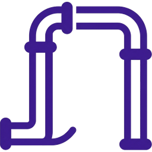
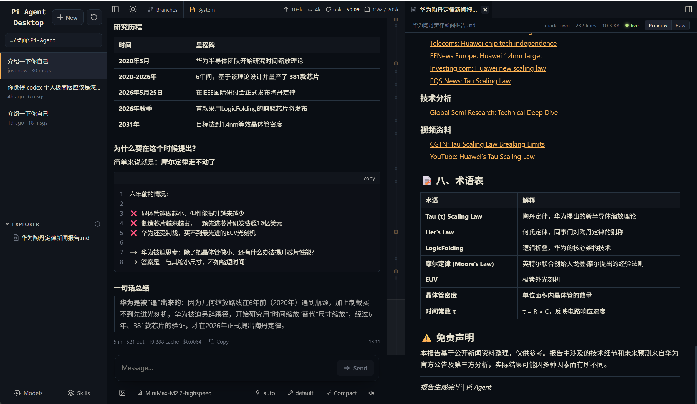

<div align="center">
  <a href="https://github.com/Chasen-Liao/pi-agent-desktop">
    
  </a>

  # Pi Agent Desktop

  ### **目标：做出个人极简版 Codex**

  [Pi 编程智能体](https://github.com/badlogic/pi-mono) 的原生桌面客户端。基于 Electron 构建，提供比浏览器更原生的使用体验。

  [](https://github.com/Chasen-Liao/pi-agent-desktop/releases)
  [](LICENSE)

  ---

  

  ---
</div>

> **上游项目**：本项目衍生自 [pi-web](https://github.com/Chasen-Liao/pi-web)，侧重于桌面端体验的优化与功能增强。

## 特性

- **原生桌面体验** — 基于 Electron 的独立窗口应用，支持系统托盘、最小化到托盘
- **会话浏览器** — 按工作目录分组展示所有 pi 会话
- **实时对话** — 通过 SSE 流式输出与智能体实时交互
- **会话分叉** — 从任意用户消息创建独立的新会话分支
- **会话内分支** — 回退到任意节点继续对话，在同一文件内创建分支
- **分支导航器** — 可视化切换同一会话内的各个分支
- **模型切换** — 对话中途随时切换模型
- **工具面板** — 控制智能体可使用的工具
- **文件浏览** — 侧边栏内置文件浏览器和查看器
- **快捷键** — `Ctrl+B` 切换左侧边栏，`Ctrl+Alt+B` 切换右侧面板
- **自动更新** — 支持 GitHub Releases 自动检查更新

## 下载安装

前往 [Releases](https://github.com/Chasen-Liao/pi-agent-desktop/releases) 页面下载最新版安装程序。

Windows 用户下载 `Pi-Agent-Desktop-Setup-x.x.x.exe`，运行即可安装。

## 开发

```bash
# 安装依赖
npm install

# 开发模式（浏览器）
npm run dev          # http://localhost:30141

# 开发模式（Electron 桌面窗口）
npm run dev:electron

# 类型检查
npx tsc --noEmit

# 代码检查
npx next lint

# 构建安装包
npm run dist
```

## 项目结构

```
app/
  api/
    sessions/      # 读写会话文件
    agent/         # 发送命令、SSE 事件流
    files/         # 文件内容读取
    models/        # 可用模型列表与默认模型
    models-config/ # 读写 models.json
components/        # UI 组件
electron/          # Electron 主进程
lib/
  session-reader.ts  # 解析 .jsonl 会话文件
  rpc-manager.ts     # 管理 AgentSession 生命周期
  normalize.ts       # 规范化 toolCall 字段名
  types.ts
```

## 技术栈

- **前端**：Next.js + React + TypeScript
- **桌面**：Electron
- **打包**：electron-builder (NSIS)
- **通信**：SSE (Server-Sent Events) 实时流式传输

## 界面截图



## 致谢

- [pi-mono](https://github.com/badlogic/pi-mono) — Pi 编程智能体核心
- [pi-web](https://github.com/agegr/pi-web) — 上游 Web 界面项目

## 许可

MIT License

## Star History

[](https://www.star-history.com/#Chasen-Liao/pi-agent-desktop&Date)
