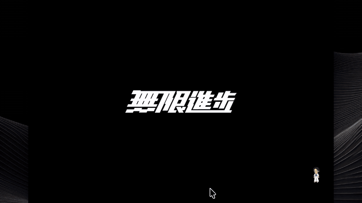

<p align="center">
  <strong>English</strong> · <a href="README.zh-CN.md">简体中文</a> · <a href="README.ja.md">日本語</a>
</p>

---

<div align="center">

<a href="https://github.com/Chasen-Liao/pi-agent-desktop">
  
</a>

# Pi Agent Desktop

**Your personal, minimalist Codex** — a native desktop client for the [Pi coding agent](https://github.com/badlogic/pi-mono), built with Electron for an experience that feels more native than the browser.

[](https://github.com/Chasen-Liao/pi-agent-desktop/releases)
[](LICENSE)
[](https://chasen-liao.github.io/pi-agent-desktop/)



</div>

> **Upstream**: this project is derived from [pi-web](https://github.com/agegr/pi-web), with a focus on desktop experience polish and feature enhancements.

## Table of Contents

- [Features](#features)
- [Download & Install](#download--install)
- [Development](#development)
- [Project Structure](#project-structure)
- [Tech Stack](#tech-stack)
- [Credits](#credits)
- [Contributing](#contributing)
- [License](#license)

## Features

### 🖥️ Desktop Experience

- **Native desktop app** — standalone Electron window with system tray and minimize-to-tray
- **Native workspace UI** — Apple-style layout, a liquid thinking orb, and a more compact message input
- **Auto-updates** — checks and installs new versions from GitHub Releases
- **Shortcuts** — `Ctrl+B` toggles the left sidebar, `Ctrl+Alt+B` toggles the right panel

### 💬 Sessions & Conversation

- **Session browser** — all Pi sessions grouped by working directory
- **Real-time conversation** — stream responses live with the agent over SSE
- **Running message queue** — press `Enter` to steer immediately, `Alt+Enter` to queue; drag or use the keyboard to reorder follow-ups
- **In-session branching** — roll back to any node and continue from there, with branches kept in the same file
- **Branch navigator** — visually switch between branches within a session
- **Fork & clone sessions** — branch from any node via API/UI, or clone a session to a plain directory or a Git worktree on a new branch
- **Session export** — export a session to HTML or Markdown in one click
- **Model switching** — switch models mid-conversation; the picker and auth panel load providers dynamically registered by your local Pi extensions

### 🤖 Agent Capabilities

- **Agent modes** — Plan / Ask / Full safety modes, with Ask-tool interception confirmation
- **Extension UI Bridge** — native dialogs for extension `confirm` / `select` / `input` / `editor` / `notify` interactions
- **Project trust** — Project Trust 409 handshake with an authorization dialog
- **Tool panel** — control which tools the agent may use
- **Long-term memory (LTM)** — project-level SQLite memory (`memory_save` / `memory_recall` / `memory_forget`) with cross-session retrieval; CJK search via FTS5 trigram; auto-observed before `agent_end` and compaction

### ⚙️ Configuration & Management

- **MCP server management** — global (`~/.pi/agent/mcp.json`) and project (`<cwd>/.pi/mcp.json`) MCP configs, manageable from the UI
- **Extensions & Skills management** — unified UI to enable, diagnose, and manage global and project extensions and Skills
- **AgentMode persistence** — writes a custom `desktop_agent_mode` node to `.jsonl` and restores the historical mode on reload
- **Interface language** — English / 简体中文, follows the system
- **File browsing** — built-in file browser and viewer in the sidebar

## Download & Install

Grab the latest installer from the [Releases](https://github.com/Chasen-Liao/pi-agent-desktop/releases) page.

Pick the package for your platform (check the current release assets):

| Platform | Package |
| --- | --- |
| Windows | `Pi-Agent-Desktop-Setup-x.x.x.exe` |
| macOS (Universal, Intel + Apple Silicon) | `Pi-Agent-Desktop-x.x.x-mac-universal.dmg` (ZIP for auto-update) |
| Linux x64 | `Pi-Agent-Desktop-x.x.x-linux-amd64.deb` |

## Development

```bash
# Install dependencies
npm install

# Dev mode (browser)
npm run dev          # http://localhost:30141

# Dev mode (Electron desktop window)
npm run dev:electron

# Type check
npx tsc --noEmit

# Lint
npm run lint

# Unit tests (includes middleware.test.ts; keep --test-force-exit)
npm test

# Windows CI subset (paths / Electron)
npm run test:windows

# macOS CI subset (paths / Electron / packaging config)
npm run test:macos

# Build the installer for the current system (Windows NSIS / Linux DEB; for macOS use the next line)
npm run dist

# Build Intel + Apple Silicon Universal macOS installer
npm run dist:mac

# GitHub Release: push a vX.Y.Z tag and Actions builds all three platforms (see docs/RELEASING.md)
```

## Project Structure

```
app/
  api/
    sessions/      # Read session files
    agent/         # Send commands, SSE event stream
    memory/        # LTM recall / remember / forget / stats / health
    files/         # Read file contents
    models/        # Available models & default model
    models-config/ # Read/write models.json
    skills/        # Skill search & install
    auth/          # Login & API Key management
    mcp/           # MCP server config read/write
    extensions/    # Extension management
    trust/         # Project trust handshake
    desktop-settings/ # Desktop-level settings
    default-cwd/   # Default working directory
    select-directory/ # Directory picker
    statusline/    # Status line data
    home/          # Home / landing data
    health/        # Health checks
components/        # UI components
electron/          # Electron main process
hooks/             # React hooks (session management, panel layout, etc.)
lib/
  ltm/               # Long-term memory (SQLite + MemoryService + hooks)
  i18n/              # UI copy (en / zh-CN / system)
  session-reader.ts  # Parse .jsonl session files
  session-branch-clone.ts # Session fork & clone params and headers
  git-worktree.ts    # Git worktree creation, identity check & cleanup
  rpc-manager.ts     # Manage AgentSession lifecycle
  normalize.ts       # Normalize toolCall field names
  types.ts
scripts/
  ensure-standalone-next-runtimes.mjs             # Patch in Turbopack runtime
  ensure-standalone-pi-runtime.mjs                # Patch in Pi runtime dependency closure
  ensure-standalone-macos-universal-runtimes.mjs  # Patch in both macOS Sharp runtimes
  dereference-standalone-symlinks.mjs             # Resolve standalone symlinks before packaging
  smoke-standalone-server.mjs                      # Smoke-test the standalone server
  smoke-packaged-standalone.mjs                    # Smoke-test the packaged app
```

## Tech Stack

| Layer | Technology |
| --- | --- |
| Frontend | Next.js + React + TypeScript + Tailwind CSS |
| Desktop | Electron |
| Packaging | electron-builder (Windows NSIS; macOS Universal DMG + ZIP; Linux DEB) |
| Realtime | SSE (Server-Sent Events) streaming |

## Credits

- [pi-mono](https://github.com/badlogic/pi-mono) — the Pi coding agent core
- [pi-web](https://github.com/agegr/pi-web) — the upstream web UI project

## Contributing

Report issues, open PRs, and merge guidelines live in [CONTRIBUTING.md](CONTRIBUTING.md). New features go on `dev/` or `future/` branches. Releasing follows [docs/RELEASING.md](docs/RELEASING.md).

## License

MIT License

## Star History

<a href="https://www.star-history.com/?repos=Chasen-Liao%2Fpi-agent-desktop&type=date&legend=top-left">
 <picture>
   <source media="(prefers-color-scheme: dark)" srcset="https://api.star-history.com/chart?repos=Chasen-Liao/pi-agent-desktop&type=date&theme=dark&legend=top-left&sealed_token=aFn-TCmARmvfk1wIdKSpOk7h46vafl3D-moDORISvD96gQ2y3nR3DvatGktptaV93Dz0ULxRvLxCT5yJ3_FzrPGXVjg7f-tJTmKpafiODarLHzonGBnXQw" />
   <source media="(prefers-color-scheme: light)" srcset="https://api.star-history.com/chart?repos=Chasen-Liao/pi-agent-desktop&type=date&legend=top-left&sealed_token=aFn-TCmARmvfk1wIdKSpOk7h46vafl3D-moDORISvD96gQ2y3nR3DvatGktptaV93Dz0ULxRvLxCT5yJ3_FzrPGXVjg7f-tJTmKpafiODarLHzonGBnXQw" />
   
 </picture>
</a>
