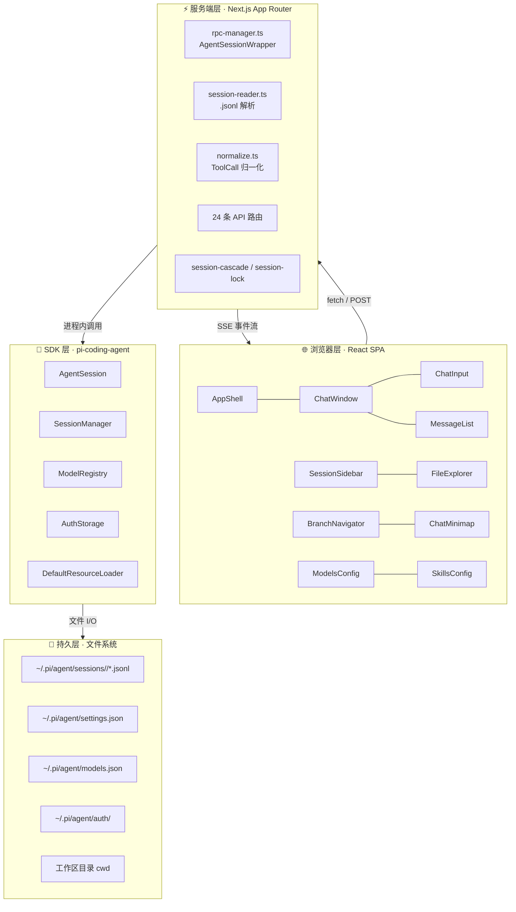
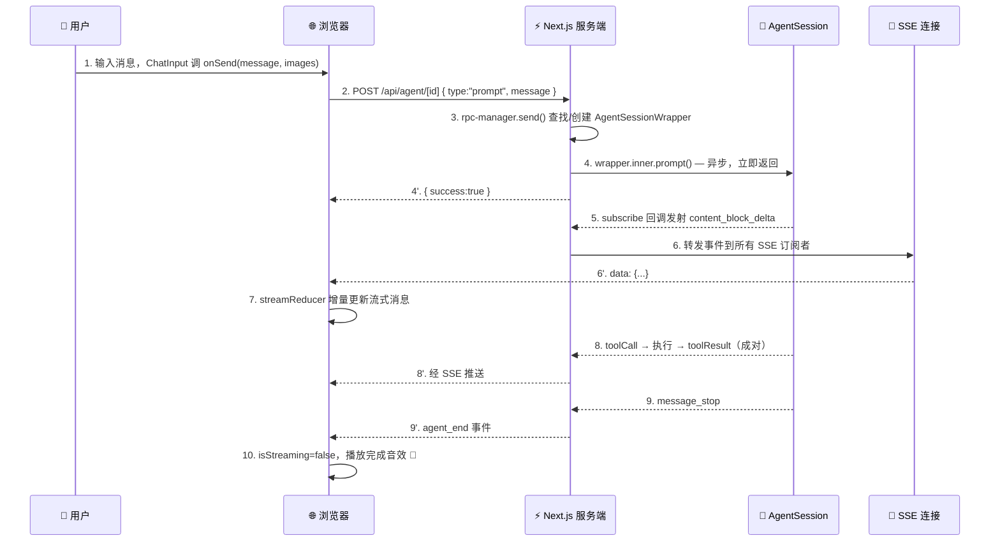
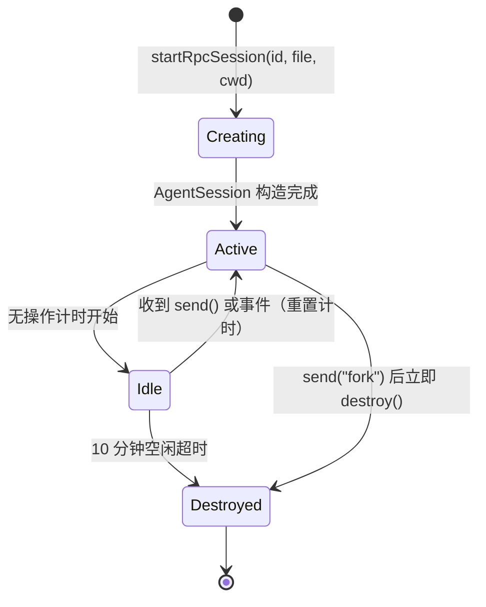

# Pi Agent Desktop · 架构深度解析

> 本文档是项目的**权威架构参考**，由 CodeGraph 静态分析 + 源码核对生成。
> 若与 `AGENTS.md` / `CLAUDE.md` 中的简要描述冲突，以本文档为准。
>
> - **项目**：`@chasen-liao/pi-agent-desktop` v0.7.16
> - **上游 SDK**：`@earendil-works/pi-coding-agent` ^0.79.8 / `@earendil-works/pi-ai` ^0.79.8
> - **更新日期**：2026-06-24

---

## 目录

1. [设计目标](#1-设计目标)
2. [双模式运行架构](#2-双模式运行架构)
3. [三层分离架构](#3-三层分离架构)
4. [目录与文件地图](#4-目录与文件地图)
5. [核心数据流：一次对话的完整旅程](#5-核心数据流一次对话的完整旅程)
6. [两种会话访问模式](#6-两种会话访问模式)
7. [AgentSession 生命周期](#7-agentsession-生命周期)
8. [会话与分支模型](#8-会话与分支模型)
9. [Pi 会话文件格式](#9-pi-会话文件格式)
10. [组件清单](#10-组件清单)
11. [Hooks 清单](#11-hooks-清单)
12. [API 路由清单](#12-api-路由清单)
13. [Electron 桌面端](#13-electron-桌面端)
14. [关键设计决策与陷阱](#14-关键设计决策与陷阱)
15. [技术栈](#15-技术栈)

---

## 1. 设计目标

Pi Agent Desktop 是 [pi coding agent](https://github.com/earendil-works/pi-coding-agent) 的桌面客户端，定位为**个人极简版 Codex**。核心目标：

- **一套 UI，两种运行模式** — 浏览器开发模式 + Electron 桌面应用模式共用同一份 Next.js / React 代码。
- **零状态库、零 UI 库** — 全部手写，仅依赖 React 内置能力（`useReducer` / `useState` / `useRef`）。
- **进程内持有 AgentSession** — 服务端不通过 IPC/RPC 调用 SDK，而是直接 `new AgentSession()`，SSE 推送零延迟。
- **原生桌面体验** — 独立窗口、系统托盘、自动更新、原生目录选择器。

---

## 2. 双模式运行架构

### Web 模式（浏览器开发）

```text
┌─────────────┐     HTTP/SSE      ┌──────────────────────┐     进程内     ┌────────────────────┐
│  Browser    │ ◀──────────────▶  │  Next.js Server      │ ◀──────────▶  │  AgentSession      │
│  (React SPA)│                   │  (App Router, :30141) │                │  (pi-coding-agent) │
└─────────────┘                   └──────────────────────┘                └────────────────────┘
```

- 启动：`npm run dev`（端口 30141）
- 浏览器 ↔ Next.js 服务端通过 REST + SSE 通信
- 服务端 ↔ AgentSession 在**同一 Node 进程内**直接调用

### Desktop 模式（Electron 生产）

```text
Pi-Agent.exe (Electron Main)
  │
  ├─ spawn(process.execPath, [server.js], {
  │     env: { ELECTRON_RUN_AS_NODE=1, PORT, HOSTNAME }
  │   })
  │     └─ Next.js standalone server on 127.0.0.1:$PORT
  │
  ├─ BrowserWindow → loadURL("http://127.0.0.1:$PORT")
  │     └─ 同一份 React UI
  │
  ├─ Tray icon（最小化到托盘 / 右键退出）
  │
  └─ autoUpdater（检查 GitHub Releases）
       └─ preload.ts 暴露 electronAPI.onUpdateAvailable / quitAndInstall
```

- 启动：`npm run dev:electron`（开发）/ `npm run dist`（打包）
- Electron 主进程以 `ELECTRON_RUN_AS_NODE=1` 把自己当作 Node.js 启动 Next.js standalone `server.js` 作为子进程
- 主进程开 `BrowserWindow` 指向 `http://127.0.0.1:PORT`，UI 与 Web 模式完全相同
- 子进程在 `before-quit` 时被 kill

---

## 3. 三层分离架构



| 层 | 职责 | 关键约束 |
|---|---|---|
| **浏览器层** | UI 渲染、用户交互、SSE 消费、URL 状态 | 零状态库；流式消息由 `streamReducer` 增量更新 |
| **服务端层** | API 路由、AgentSession 包装、文件解析 | 活跃 session 必须存 `globalThis`（HMR 安全） |
| **SDK 层** | 真正的 AI 对话引擎、模型调度、工具执行 | 由 `@earendil-works/pi-coding-agent` 提供 |
| **持久层** | 所有状态最终落到磁盘 `.jsonl` 文件 | append-only；header 含 `parentSession` 显示元数据 |

---

## 4. 目录与文件地图

```text
pi-agent-desktop/
├── package.json                  @chasen-liao/pi-agent-desktop v0.7.16
├── next.config.ts                output:"standalone" + server external packages
├── tailwind.config.ts            Tailwind 4 配置
├── tsconfig.json                 strict + bundler resolution
├── electron-builder.yml          NSIS 打包配置
├── eslint.config.mjs             ESLint 9 flat config
│
├── bin/
│   └── pi-web.js                 CLI 入口 → next start（npm i -g / npx）
│
├── app/                          Next.js App Router
│   ├── layout.tsx                主题初始化 + 字体 + 防 FOUC 脚本
│   ├── page.tsx                  挂载 <AppShell/>
│   ├── globals.css               CSS 变量主题 + View Transitions
│   └── api/                      24 条 API 路由（见 §12）
│
├── components/                   React 组件（见 §10）
│   ├── AppShell.tsx              顶层布局
│   ├── ChatWindow.tsx            对话外壳（核心）
│   ├── ChatInput.tsx             输入栏
│   ├── MessageList.tsx           消息列表（虚拟化）
│   ├── MessageView.tsx           单条消息渲染
│   ├── SessionSidebar.tsx        会话树侧边栏
│   ├── BranchNavigator.tsx       会话内分支切换器
│   ├── ChatMinimap.tsx           滚动缩略导航
│   ├── ToolPanel.tsx             工具预设面板
│   ├── ModelsConfig.tsx          模型配置弹窗
│   ├── SkillsConfig.tsx          技能管理弹窗
│   ├── FileExplorer.tsx          文件树
│   ├── FileViewer.tsx            文件内容查看
│   ├── FileIcons.tsx             SVG 文件图标
│   ├── TabBar.tsx                顶部标签栏
│   ├── StatsBar.tsx              统计栏
│   ├── chat-input/               输入栏子组件
│   │   ├── AttachmentPreview.tsx
│   │   ├── ModelSelector.tsx
│   │   ├── PresetSelector.tsx
│   │   └── types.ts
│   ├── session-sidebar/          侧边栏子组件
│   │   ├── helpers.ts
│   │   ├── PiAgentTitle.tsx
│   │   ├── SessionTree.tsx
│   │   └── SidebarHeader.tsx
│   ├── models-config/            模型配置子组件
│   ├── file-viewer-virtualization.ts
│   └── FileViewer / file-viewer-virtualization .test.ts
│
├── hooks/                        React Hooks（见 §11）
│   ├── useAgentSession.ts        Agent 交互主 hook
│   ├── useTheme.ts               View Transitions 主题切换
│   ├── useAudio.ts               完成音效
│   ├── useDragDrop.ts            图片拖拽
│   ├── useFileTabs.ts            文件标签管理
│   ├── usePanelLayout.ts         侧边栏宽度计算
│   └── agent-session/            useAgentSession 拆分出的子 hooks
│       ├── use-session-loader.ts
│       ├── use-agent-events.ts
│       ├── use-chat-scroll.ts
│       ├── session-loader-api.ts
│       ├── agent-events-manager.ts
│       ├── agent-phase.ts
│       ├── session-stats.ts
│       └── stream-state.ts
│
├── lib/                          服务端 / 共享库
│   ├── rpc-manager.ts            ★ AgentSessionWrapper + 注册表 + startRpcSession
│   ├── session-reader.ts         ★ .jsonl 解析 + 路径缓存 + 会话树
│   ├── session-cascade.ts        会话删除时子会话级联重 parent
│   ├── session-lock.ts           会话文件并发锁
│   ├── normalize.ts              ToolCall 字段归一化
│   ├── agent-client.ts           浏览器 → /api/agent/[id] 的 SSE 客户端封装
│   ├── agent-commands.ts         客户端 agent 命令帮助函数
│   ├── allowed-roots.ts          文件访问白名单鉴权（5s TTL 缓存）
│   ├── auth-policy.ts            API 鉴权策略
│   ├── path-policy.ts            路径安全检查
│   ├── skills-policy.ts          技能鉴权策略
│   ├── slash-commands.ts         客户端 / 斜杠命令解析
│   ├── types.ts                  共享 TypeScript 类型
│   ├── pi-types.ts               pi-coding-agent SDK 接口封装
│   ├── file-paths.ts             跨平台路径归一化（Windows 反斜杠→正斜杠）
│   ├── npx.ts                    安全 npx 调用（绕过 CVE-2024-27980）
│   ├── api-error.ts              API 错误格式化
│   ├── custom-path-selection.ts  自定义路径选择
│   ├── ayu-syntax-theme.ts       ayu 语法高亮主题
│   └── panel-layout.js           侧边栏宽度计算（CJS，构建兼容）
│
├── electron/                     Electron 主进程（见 §13）
│   ├── main.ts                   ★ 主进程入口
│   ├── preload.ts                contextBridge 暴露更新 API
│   ├── tray.ts                   系统托盘
│   ├── port-selection.ts         端口选择算法
│   ├── server-wait.ts            等待 Next.js 子进程就绪
│   ├── process-tree.ts           进程树管理
│   ├── restart-policy.ts         重启策略
│   ├── startup-failure.ts        启动失败诊断
│   ├── log-format.ts             日志格式化
│   ├── env-filter.ts             环境变量过滤
│   ├── startup.html / startup.js 启动占位页
│   ├── tsconfig.json             electron 专用 tsconfig
│   └── dist/                     tsc 输出
│
├── build/
│   ├── installer.nsh             NSIS 自定义安装脚本
│   └── tray-icon.ico             托盘图标
│
├── docs/                         本目录
│   ├── ARCHITECTURE.md           ★ 本文档
│   ├── architecture.html         可视化架构网页
│   ├── index.html                项目介绍页
│   ├── script.js / styles.css    index.html 配套
│   └── SKILL_find_skills.md
│
├── public/                       静态资源（logo / gif / icons）
├── data/
├── release/                      electron-builder 输出
└── test/
```

---

## 5. 核心数据流：一次对话的完整旅程



**关键点**：

- `AgentSession.prompt()` 是**异步**的，调用立即返回；真正的内容由 `subscribe` 回调推送。
- SSE 是**单向推送**（服务端 → 浏览器），适合 agent 事件流；30 秒心跳防止代理超时。
- 浏览器侧 `streamReducer` 维护流式状态机（`idle → streaming → done`），仅增量更新当前流式消息，避免重渲染整列表。

---

## 6. 两种会话访问模式

会话浏览和交互对话走**完全不同的路径**，避免为只读操作创建重量级的 AgentSession。

| | 📖 只读浏览 | ⚡ 交互对话 |
|---|---|---|
| **触发** | 侧边栏点击会话 | 发送消息 / 恢复流式 |
| **路径** | `app/api/sessions/*` → `lib/session-reader.ts` | `app/api/agent/*` → `lib/rpc-manager.ts` |
| **是否创建 AgentSession** | ❌ 否 | ✅ 是 |
| **核心函数** | `buildSessionContext()` / `buildTree()` | `startRpcSession()` |
| **开销** | 零内存、零启动延迟 | AgentSessionWrapper + 10 分钟空闲超时 |
| **并发控制** | 文件锁 `session-lock.ts` | `globalThis.__piStartLocks` Promise 锁 |

---

## 7. AgentSession 生命周期

`lib/rpc-manager.ts` 中的 `AgentSessionWrapper` 是 SDK `AgentSession` 的进程内壳。



**五个必须存 `globalThis` 的原因**（Next.js HMR 会丢弃模块级变量）：

| 全局变量 | 用途 | 定义位置 | 回收策略 |
|---|---|---|---|
| `globalThis.__piSessions` | `Map<sessionId, AgentSessionWrapper>` 活跃会话注册表 | [lib/rpc-manager.ts](../lib/rpc-manager.ts) | wrapper.destroy() 时 delete；process.once("exit") 全清 |
| `globalThis.__piSessionPathCache` | `sessionId → .jsonl` 绝对路径缓存 | [lib/session-reader.ts](../lib/session-reader.ts) | invalidateSessionPathCache(id) 单条删；fork 失败 / DELETE 后主动清 |
| `globalThis.__piStartLocks` | `Map<sessionId, Promise>` 并发启动共享锁 | [lib/rpc-manager.ts](../lib/rpc-manager.ts) | startRpcSession finally 块自动清 |
| `globalThis.__piWriteLocks` | `Map<filePath, Promise>` per-file 写入锁 | [lib/session-lock.ts](../lib/session-lock.ts) | withFileLock finally 块自动清 |
| `globalThis.__piAllowedRootsCache` | `{ roots: Set<string>; expiresAt: number }` 文件访问白名单缓存（见 §14.11） | [lib/allowed-roots.ts](../lib/allowed-roots.ts) | 5s TTL 自动过期；POST /api/agent/new 时主动 add |

**Fork 注册顺序陷阱**（详见 §14.2）：fork 在**文件层**通过 `SessionManager.createBranchedSession()`（或首条消息前的 `SessionManager.create()`）完成，**不修改旧 wrapper 内部状态**。但 `send("fork")` 仍需先 `startRpcSession(newSessionId, ...)` 预注册新 wrapper，再 `this.destroy()` 旧 wrapper，以满足"返回时 newSessionId 已在注册表"的契约。

---

## 8. 会话与分支模型

Pi 有两种独立的分支机制，**不要混淆**：

### Fork（跨文件分支）

- 创建**新的独立 `.jsonl` 文件**
- header 中写入 `parentSession: "/abs/path/to/parent.jsonl"`
- 侧边栏树状显示为父会话的子节点
- 触发位置：用户消息上的 Fork 按钮
- API：`POST /api/agent/[id]` body `{ type:"fork", entryId }`

### 会话内分支（同文件分支）

- 仍在**同一个 `.jsonl` 文件**内
- 通过不同 entry 的 `parentId` 形成树
- 切换分支：`navigate_tree` 命令
- UI：`BranchNavigator` 组件可视化切换
- 上下文获取：`GET /api/sessions/[id]/context?leafId=...`

### 数据结构对应

- `entryIds[]` 与 `messages[]` 是**平行数组** —— 把 UI 显示的每条消息映射回 `.jsonl` entry id
- 用于支持 fork 与会话内导航的回溯

---

## 9. Pi 会话文件格式

**位置**：`~/.pi/agent/sessions/<encoded-cwd>/<timestamp>_<uuid>.jsonl`

```jsonl
{"type":"session","version":3,"id":"<uuid>","timestamp":"...","cwd":"/path","parentSession":"/abs/path/to/parent.jsonl"}
{"type":"model_change","id":"<8hex>","parentId":null,"provider":"zenmux","modelId":"claude-sonnet-4-6","timestamp":"..."}
{"type":"message","id":"<8hex>","parentId":"<8hex>","message":{"role":"user","content":"..."}}
{"type":"message","id":"<8hex>","parentId":"<8hex>","message":{"role":"assistant","content":[...]}}
{"type":"message","id":"<8hex>","parentId":"<8hex>","message":{"role":"toolResult","toolCallId":"...","content":[...]}}
{"type":"compaction","id":"<8hex>","parentId":"<8hex>","summary":"...","firstKeptEntryId":"<8hex>","tokensBefore":N}
{"type":"session_info","id":"...","parentId":"...","name":"user-defined name"}
```

- `parentSession` 是**显示元数据**，对聊天内容零影响；可安全 `writeFileSync` 整个文件（pi 自己的迁移也这么做）。
- 删除会话时，`session-cascade.ts` 会把所有子会话的 `parentSession` 级联重指向到祖父会话。

---

## 10. 组件清单

> 完整清单基于 CodeGraph 索引。所有组件**手写，零 UI 库依赖**，通过 CSS 变量实现暗色/亮色主题。

### 顶层组件（17 个）

| 组件 | 职责 |
|---|---|
| `AppShell.tsx` | 顶层布局：侧边栏 + 聊天区 + 标签页；URL `?session=` 状态；模型/技能弹窗 |
| `ChatWindow.tsx` | 对话区域外壳；委托 `useAgentSession` 处理所有 agent 交互 |
| `ChatInput.tsx` | 输入栏：模型选择、工具预设、Thinking Level、图片拖拽 |
| `MessageList.tsx` | 消息列表（虚拟化滚动） |
| `MessageView.tsx` | 单条消息渲染：Markdown + Prism 高亮 + Thinking 折叠 + 工具调用配对 |
| `SessionSidebar.tsx` | 按 cwd 分组的会话树 + 内嵌 `FileExplorer` |
| `BranchNavigator.tsx` | 会话内分支切换器（线性链自动压缩） |
| `ChatMinimap.tsx` | 消息列表右侧的滚动缩略导航 |
| `ToolPanel.tsx` | 三档工具预设：`PRESET_NONE` / `PRESET_DEFAULT` / `PRESET_FULL` |
| `ModelsConfig.tsx` | 25+ 提供商配置弹窗 |
| `SkillsConfig.tsx` | 技能搜索/安装/启用弹窗 |
| `FileExplorer.tsx` | 懒加载目录浏览，支持 `@` 引用插入 |
| `FileViewer.tsx` | 文件内容查看：代码高亮、图片、音频、Myers diff |
| `FileIcons.tsx` | 纯 SVG 单色文件图标（按扩展名匹配） |
| `TabBar.tsx` | 顶部标签栏：Chat 标签 + 多文件标签 |
| `StatsBar.tsx` | token / cost / 上下文用量统计 |
| `file-viewer-virtualization.ts` | FileViewer 的虚拟化算法 |

### 子组件目录

```text
components/chat-input/
├── AttachmentPreview.tsx     图片附件预览
├── ModelSelector.tsx         模型下拉选择
├── PresetSelector.tsx        工具预设下拉
└── types.ts                  子组件共享类型

components/session-sidebar/
├── SidebarHeader.tsx         侧边栏头部
├── PiAgentTitle.tsx          Pi Agent 标题（SidebarHeader 内使用）
├── SessionTree.tsx           会话树渲染（含内部 SessionTreeItem）
└── helpers.ts                树构建辅助

components/models-config/     模型配置弹窗的子组件
```

---

## 11. Hooks 清单

### 顶层 Hooks（6 个）

| Hook | 职责 |
|---|---|
| `useAgentSession.ts` | ★ Agent 交互主 hook（加载、SSE、发送、中止、fork、导航、压缩、模型切换、工具预设） |
| `useTheme.ts` | View Transitions API 圆形擦除主题切换 |
| `useAudio.ts` | 完成音效 / 压缩音效 |
| `useDragDrop.ts` | 图片拖拽到输入框 |
| `useFileTabs.ts` | 文件标签页状态管理 |
| `usePanelLayout.ts` | 侧边栏 / 右侧面板宽度持久化 |

### `hooks/agent-session/` 子 Hooks（8 个）

`useAgentSession` 已按职责拆分，主 hook 组合这些子 hook：

| 子 Hook / 模块 | 职责 |
|---|---|
| `use-session-loader.ts` | 会话加载、`messages[]` / `entryIds[]` 状态 |
| `use-agent-events.ts` | SSE `EventSource` 连接管理 |
| `use-chat-scroll.ts` | 滚动容器行为（粘底、跳转到用户消息） |
| `session-loader-api.ts` | 调用 `/api/sessions/[id]` 与 `/context?leafId=` |
| `agent-events-manager.ts` | agent 事件分发到状态更新 |
| `agent-phase.ts` | `AgentPhase` 状态机（waiting_model / running_tool 等） |
| `session-stats.ts` | `calculateSessionStats()` 消息统计 |
| `stream-state.ts` | `streamReducer` 流式消息状态机 |

---

## 12. API 路由清单

> 共 **24 条** route.ts（CodeGraph 索引统计）。

### Agent 会话交互（3 条）

| 路由 | 方法 | 用途 |
|---|---|---|
| `app/api/agent/new/route.ts` | POST | 创建新会话并发送首条消息 |
| `app/api/agent/[id]/route.ts` | GET / POST | GET 状态；POST 任意命令（prompt / abort / fork / navigate_tree / set_model / compact / get_tools） |
| `app/api/agent/[id]/events/route.ts` | GET | SSE 事件流（30s 心跳） |

### 会话浏览（4 条，只读）

| 路由 | 方法 | 用途 |
|---|---|---|
| `app/api/sessions/route.ts` | GET | 列出所有会话（按 cwd 分组） |
| `app/api/sessions/[id]/route.ts` | GET / PATCH / DELETE | 读取 / 重命名 / 删除 |
| `app/api/sessions/[id]/context/route.ts` | GET | `?leafId=` 返回指定分支叶子的上下文 |
| `app/api/sessions/new/route.ts` | — | 已弃用，返回 410 |

### 文件与目录（4 条）

| 路由 | 方法 | 用途 |
|---|---|---|
| `app/api/files/[...path]/route.ts` | GET / PUT | 安全文件访问：GET `?type=list\|read\|watch`（目录列表 / 文件读取 / SSE 监听变更）；PUT 写入文件。**allowed-roots 鉴权**，仅允许 session cwd 与 `~/pi-cwd-*` 下的路径（详见 §14.11） |
| `app/api/home/route.ts` | GET | 用户主目录路径 |
| `app/api/default-cwd/route.ts` | POST | 创建并返回默认项目目录 |
| `app/api/select-directory/route.ts` | POST | 原生 Windows 文件夹选择器（仅桌面端） |

### 模型配置（3 条）

| 路由 | 方法 | 用途 |
|---|---|---|
| `app/api/models/route.ts` | GET | 模型列表 + thinking levels + `defaultModel` |
| `app/api/models-config/route.ts` | GET / PUT | 读写 `~/.pi/agent/models.json` |
| `app/api/models-config/test/route.ts` | POST | 测试模型连接 |

### Skills（3 条）

| 路由 | 方法 | 用途 |
|---|---|---|
| `app/api/skills/route.ts` | GET | 列出 / 启用 / 禁用技能 |
| `app/api/skills/search/route.ts` | POST | 搜索远程技能 |
| `app/api/skills/install/route.ts` | POST | 安装技能 |

### 认证（5 条）

| 路由 | 方法 | 用途 |
|---|---|---|
| `app/api/auth/providers/route.ts` | GET | 列出已配置的提供商 |
| `app/api/auth/all-providers/route.ts` | GET | 列出所有支持的提供商 |
| `app/api/auth/login/[provider]/route.ts` | GET / POST | OAuth 登录 |
| `app/api/auth/logout/[provider]/route.ts` | POST | 登出 |
| `app/api/auth/api-key/[provider]/route.ts` | GET / POST / DELETE | API Key 状态查询 / 保存 / 删除 |

### 其他（2 条）

| 路由 | 方法 | 用途 |
|---|---|---|
| `app/api/statusline/route.ts` | GET | git 分支与状态元数据 |
| `app/api/health/route.ts` | GET | 桌面端启动健康探测（`server-wait.ts` 调用） |

---

## 13. Electron 桌面端

### 主进程 `electron/main.ts`

职责链：

1. **端口选择**（`port-selection.ts`）— 找一个可用端口
2. **启动 Next.js 子进程** — `spawn(process.execPath, [server.js], { env: ELECTRON_RUN_AS_NODE=1 })`
3. **等待就绪**（`server-wait.ts`）— 双重探测：
   - 端口探测：请求 `/api/health`
   - stdout 嗅探：匹配 Next.js 输出的 "Ready"
4. **创建 `BrowserWindow`** → `loadURL("http://127.0.0.1:PORT")`
5. **托盘**（`tray.ts`）— 最小化到托盘 / 右键退出
6. **自动更新**（`autoUpdater`）— 检查 GitHub Releases

### 辅助模块

| 文件 | 职责 |
|---|---|
| `preload.ts` | `contextBridge` 暴露 `onUpdateAvailable` / `quitAndInstall` |
| `process-tree.ts` | 杀掉子进程树（不只是直接子进程） |
| `restart-policy.ts` | 子进程崩溃后的重启策略 |
| `startup-failure.ts` | 启动失败诊断 UI（`startup.html`） |
| `log-format.ts` | 日志格式化 |
| `env-filter.ts` | 过滤敏感环境变量传给子进程 |

### 生产环境打包布局（NSIS 安装包内）

```
resources/
  standalone/              ← .next/standalone (extraResources)
    server.js
    node_modules/next/     ← 单独 extraResources 条目（见陷阱 §14.6）
    .next/static/
    public/
  app/
    build/                 ← tray-icon.ico
  electron.asar            ← 编译后的 electron/dist/
```

---

## 14. 关键设计决策与陷阱

### 14.1 globalThis 存储会话注册表

Next.js 热重载（HMR）会丢弃模块级变量。若把 `Map<sessionId, AgentSessionWrapper>` 放在模块顶层，每次 HMR 后所有活跃 session 都会丢失。

**解决**：存到五个 globalThis 变量（详见 §7 表格）：`globalThis.__piSessions`、`globalThis.__piSessionPathCache`、`globalThis.__piStartLocks`、`globalThis.__piWriteLocks`、`globalThis.__piAllowedRootsCache`。

### 14.2 Fork 的执行顺序：预注册 → 销毁旧 wrapper

**背景**：Fork 在**文件层**完成，而非修改 wrapper 内部状态。`lib/rpc-manager.ts` 的 `case "fork"` 通过 `SessionManager.createBranchedSession(entry.parentId)`（或首条消息前的 `SessionManager.create()`）创建一个全新的 `.jsonl` 文件，然后用 `startRpcSession()` 为新文件构造一个**全新的 `AgentSession` 实例**（不是复用旧的）。

**执行顺序**（见 `lib/rpc-manager.ts` `send()` 的 `case "fork"` 分支）：

1. 读取 `entryId`，用 `SessionManager` 在磁盘上创建新 session 文件：
   - `entry.parentId === null`（首条消息前）：`SessionManager.create(cwd, sessionDir)` + `newSession({ parentSession })`
   - 否则：`SessionManager.open(currentSessionFile).createBranchedSession(entry.parentId)` 拷贝到 fork 点之前的路径
2. `cacheSessionPath(newSessionId, newSessionFile)` 缓存路径
3. **预注册**：`await startRpcSession(newSessionId, newSessionFile, newCwd)` —— 此时旧 wrapper 仍存活，新 wrapper 已进注册表
4. `this.destroy()` 销毁旧 wrapper（释放订阅、idle timer、内存；旧 wrapper 不会被自动复用，因为新请求会命中新 wrapper）
5. 返回 `{ cancelled: false, newSessionId }`

**契约**：`send()` 返回时，`newSessionId` 已在注册表中。若 `startRpcSession` 抛错，旧 wrapper **不销毁**（保持可用），孤儿新 `.jsonl` 文件可接受（下次 fork 会覆盖）。

**为什么要立即销毁旧 wrapper**：旧 wrapper 持有的 `AgentSession` 仍订阅着原 session 的事件、跑着 10 分钟 idle timer。fork 是用户"另起炉灶"的信号，旧 wrapper 不再会被请求到（后续请求走新 id），立即销毁可及时释放资源，而非等 idle 超时。

### 14.3 ToolCall 字段归一化

Pi SDK 存储格式 `{ id, name, arguments }` 与前端类型 `{ toolCallId, toolName, input }` 不一致。`normalizeToolCalls()`（`lib/normalize.ts`）在**两条路径**都做转换：

- 文件加载：`session-reader.ts` 调用
- SSE 流：`ChatWindow.handleAgentEvent()` 调用

### 14.4 两种分支机制不要混淆

见 §8。**Fork = 跨文件**，**会话内分支 = 同文件**，分别由不同 UI 入口和不同 API 触发。

### 14.5 SSE 而非 WebSocket

Agent 事件是**单向推送**（服务端 → 浏览器），SSE 天然适合，无需 WebSocket 的双向能力。

- 30 秒心跳防止代理超时
- 页面刷新时若 `state.isStreaming === true`，自动重连 SSE
- 网络断连时 `onerror` 有 1 秒自动重连

### 14.6 electron-builder extraResources 必须单独包含 node_modules

electron-builder 的 `extraResources` 带 `filter: ["**/*"]` 会**静默排除 `node_modules` 目录**，即使 `.next/standalone` 里有 `node_modules/next` 也会被漏掉。standalone `server.js` 执行 `require("next")` 会失败。

**解决**（见 `electron-builder.yml`）：

```yaml
extraResources:
  - from: .next/standalone
    to: standalone
    filter:
      - "**/*"
      - "!node_modules"
  - from: .next/standalone/node_modules   # ← 单独条目
    to: standalone/node_modules
```

### 14.7 Windows 兼容层

| 文件 | 问题 | 解决 |
|---|---|---|
| `lib/file-paths.ts` | Windows 反斜杠 | 统一正斜杠 |
| `lib/npx.ts` | `npx.cmd` shell 限制（CVE-2024-27980） | 直接 spawn，绕过 shell |
| `bin/pi-web.js` | 路径含空格 | 直接调用 next JS 入口 |

### 14.8 桌面端启动双重就绪探测

冷启动时 Next.js 子进程的端口监听晚于 `BrowserWindow.loadURL`，会导致 race。`server-wait.ts` 同时做：

1. **端口探测**：循环请求 `/api/health`
2. **stdout 嗅探**：监听子进程 stdout，匹配 "Ready" 字样

任一通过即视为就绪。

### 14.9 Compaction SSE 事件版本兼容

新版 pi 发 `compaction_start` / `compaction_end`；旧版发 `auto_compaction_start` / `auto_compaction_end`。`handleAgentEvent` 同时接受两套事件名，保持 `isCompacting` 状态同步。

### 14.10 next.config.ts 关键配置

```ts
output: "standalone"
serverExternalPackages: [
  "@earendil-works/pi-coding-agent",
  "@earendil-works/pi-ai",
]
```

把两个 pi 包设为 server external，避免 webpack 打包它们（它们依赖 Node 原生模块）。

### 14.11 安全文件访问：allowed-roots 鉴权模型

`app/api/files/[...path]/route.ts` 是 FileExplorer / FileViewer 的后端，直接读用户磁盘，必须防止任意路径访问。

**允许的根目录**（`getAllowedRoots()`）：

1. 所有 pi session 的 `cwd`（来自 `listAllSessions()`）
2. `~/pi-cwd-*`（`default-cwd` 端点创建的目录，命名 `pi-cwd-YYYYMMDD`）

**路径穿越防护**（`isPathAllowed()`）：

- 逐根比较：`path.resolve(target)` 必须等于某根或以 `根 + 分隔符` 为前缀，否则 403
- **Windows / POSIX 双规则**：当 target 或 root 看起来是 Windows 绝对路径（`C:\` / `\\`）时用 `path.win32` 解析并做大小写不敏感比较；否则用宿主 `path`。避免跨平台路径分隔符和盘符大小写导致的误判
- Windows 绝对路径判定：`/^[a-zA-Z]:[\\/]/` 或 `\\` / `//` 开头

**`globalThis.__piAllowedRootsCache`（5s TTL）**：每次请求都调 `listAllSessions()` 全盘扫描代价高；缓存允许根集合 5 秒，新创建的 cwd 也能 promptly 出现。必须存 globalThis 以存活 HMR（与 §14.1 同理）。

**三种 GET 模式**（`?type=`）：

| type | 行为 |
|---|---|
| `list`（默认） | 目录列表：过滤 `node_modules`/`.git`/`.next` 等 `IGNORED_NAMES` 与 `.pyc` 后缀，目录在前字母序 |
| `read` | 文件读取：图片/音频走流式 `streamFile`（支持 HTTP Range），文本返回 `{ content, language, size }` |
| `watch` | SSE：`fs.watch` 监听文件变更，发射 `change` 事件（mtime + size） |

**大小限制**：

| 场景 | 上限 | 超限返回 |
|---|---|---|
| 文本预览（read） | 256 KB | 413 |
| 文本写入（PUT） | 512 KB | 413 |
| 图片预览 | 10 MB | 413 |
| 音频流式 | 无上限（Range 分块） | — |

**`streamFile` 的连接清理**：用 `ReadableStream` 包装 `fs.createReadStream`，`cancel()` 时 `fileStream.destroy()`。浏览器媒体探针常提前断开，`controller.enqueue/close/error` 全部 try-catch 以容忍客户端已放弃的响应。

**PUT 写入**：`{ content: string }` 覆盖写文件，同样受 allowed-roots 鉴权与 512 KB 上限约束。

---

## 15. 技术栈

| 类别 | 技术 | 版本 |
|---|---|---|
| 框架 | Next.js（App Router） | 16.2.1 |
| UI 库 | React | ^19.2.4 |
| 样式 | Tailwind CSS + CSS 变量 | ^4.2.2 |
| 类型 | TypeScript（strict） | ^5 |
| Markdown | react-markdown | ^10.1.0 |
| Markdown | remark-gfm | ^4.0.1 |
| 代码高亮 | react-syntax-highlighter（Prism） | ^16.1.1 |
| AI SDK | @earendil-works/pi-coding-agent | ^0.79.8 |
| AI SDK | @earendil-works/pi-ai | ^0.79.8 |
| 品牌图标 | @lobehub/icons | ^5.6.0 |
| 桌面壳 | Electron | ^36.9.5 |
| 打包 | electron-builder（NSIS） | ^26.8.1 |
| 自动更新 | electron-updater | ^6.8.3 |
| Lint | ESLint（flat config） | ^9 |
| 测试 | node:test | 内置 |

**不使用**：状态管理库（Redux / Zustand）、UI 组件库（shadcn / MUI）、CSS-in-JS。

---

## 附录：相关文档

- [AGENTS.md](../AGENTS.md) — 开发快速上手 + 已精简的架构摘要
- [CLAUDE.md](../CLAUDE.md) — Claude Code 使用指南 + 已精简的架构摘要
- [docs/architecture.html](./architecture.html) — 可视化架构网页（浏览器打开）
- [docs/index.html](./index.html) — 项目介绍页
