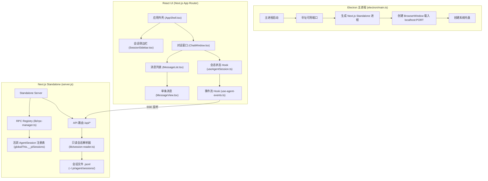

# Pi Agent Desktop 深度架构与代码优化分析报告

本报告对 Pi Agent Desktop 项目进行深度代码与架构分析，重点聚焦于前端组件设计、状态管理、渲染效率、流式传输、会话管理以及测试覆盖率。报告提炼了 10 个关键优化点，涵盖性能（Performance）、可维护性（Maintainability）、可靠性（Reliability）和测试（Testing），并给出了具体的架构图和分阶段实施建议。

---

## 架构概览

以下是 Pi Agent Desktop 的系统架构流向图，展示了 Electron 主进程、Next.js 服务端（运行于 `ELECTRON_RUN_AS_NODE=1` 模式）以及前端 React 渲染进程之间的协作关系：



---

## 优化点 1：巨石单体组件拆分 (Maintainability / Performance)
* **涉及文件**：
  * [ModelsConfig.tsx](file:///d:/MyProjects/pi-agent-desktop/components/ModelsConfig.tsx) (~1604 行，76.9KB)
  * [ChatInput.tsx](file:///d:/MyProjects/pi-agent-desktop/components/ChatInput.tsx) (~1145 行，55.1KB)
  * [SessionSidebar.tsx](file:///d:/MyProjects/pi-agent-desktop/components/SessionSidebar.tsx) (~1123 行，44.4KB)
* **当前问题**：
  * 这些组件体积过于庞大，将很多职责不相关的视图、辅助方法和局部状态混合在单文件内。例如，`ModelsConfig.tsx` 既声明了庞大的服务图标配置 `PROVIDER_ICONS`，又在一个文件内堆叠了 `Field` 表单、`SecretTextInput` 输入框、`ProviderDetail` 细节面板、`ThinkingLevelMapEditor` 思考等级映射表、`ModelDetail` 模型参数详情及 `OAuthDetail` 验证回调等。
  * 这不仅显著拉低了组件的阅读和维护效率，也导致对局部表单的改动会造成整个大模块的全量评估。
* **重构方案**：
  * 将 `ModelsConfig.tsx` 拆分并放入独立的目录 `components/models-config/` 下：
    * `ModelsConfigModal.tsx`（负责模态框容器和主面板布局）
    * `ProviderDetail.tsx`（网络服务提供商配置视图）
    * `ModelDetail.tsx`（模型具体细节与连通性测试按钮）
    * `OAuthDetail.tsx`（OAuth 登录流状态机）
    * `ThinkingLevelMapEditor.tsx`（思考档位自定义映射组件）
  * 将 `ChatInput.tsx` 拆分至 `components/chat-input/` 目录下：
    * `ModelSelector.tsx`（模型选择器）
    * `PresetSelector.tsx`（工具预设控制）
    * `AttachmentPreview.tsx`（附件与图片预览）
  * 将 `SessionSidebar.tsx` 拆分至 `components/session-sidebar/` 目录下：
    * `SidebarHeader.tsx`（会话树过滤与新建操作栏）
    * `SessionTree.tsx`（按工作目录聚类渲染的会话树）
    * `SidebarFooter.tsx`（侧边栏底部模型和技能入口配置）

---

## 优化点 2：海量内联样式迁移 (Performance / Maintainability)
* **涉及文件**：
  * [MessageView.tsx](file:///d:/MyProjects/pi-agent-desktop/components/MessageView.tsx)
  * [SessionSidebar.tsx](file:///d:/MyProjects/pi-agent-desktop/components/SessionSidebar.tsx)
  * [AppShell.tsx](file:///d:/MyProjects/pi-agent-desktop/components/AppShell.tsx)
* **当前问题**：
  * 几乎所有核心组件都在 JSX 内重度运用了 `style={{ ... }}` 行内对象形式进行布局排版。
  * **React 渲染痛点**：在每一次父级组件渲染时，行内样式都会生成一个全新的 Object 引用（例如 `style={{ display: "flex", gap: 6 }}`）。当它传递给子组件时，即使子组件使用了 `React.memo` 包装，也会由于浅层属性对比不一致（Object 引用变化）而强行失效，进而导致子树频繁多余重绘，TPS 流式高频刷新时性能损耗极高。
* **重构方案**：
  * 项目中已经将 Tailwind CSS v4 作为 `devDependencies` 配置入库，建议充分发挥其效能。
  * 将所有静态 UI 样式抽离成 Tailwind 实用类名或标准 CSS 类。
  * 行内仅保留与运行时强相关的状态，如动态尺寸（例如 `style={{ width: sidebarOpen ? panelWidths.left : 0 }}`）。

---

## 优化点 3：AppShell 状态暴涨与非必要重渲染隔离 (Performance / Maintainability)
* **涉及文件**：
  * [AppShell.tsx](file:///d:/MyProjects/pi-agent-desktop/components/AppShell.tsx)
* **当前问题**：
  * `AppShell` 作为顶层骨架，管理了超过 20 个 `useState` 变量（包括侧边栏宽窄、标签页信息、活动分支树、模型配置开关、高频更新的 token 用量/实时花销等）。
  * 任何状态的变动都会引发整个 `AppShell` 根组件及其全部未 memo 包装子树的完全 Diff 重绘。特别是高频计算的 Token 消耗、Context Window 百分比状态，稍微一变，就会导致侧边栏、右侧文件浏览器等完全无关的面板反复刷新。
  * 大量组件状态回调被深层传递，形成严重的 Prop Drilling（属性深层传递）现象。
* **重构方案**：
  * 抽取模块化业务 Hook，剥离复杂状态：
    * `usePanelLayout`：专职管理左右滑块拖拽及边界限制。
    * `useFileTabs`：专职管理当前打开的代码文件标签状态。
  * 对高频变动的 Token / Cost 及 Context 用量监控栏进行抽取，独立封装为 `StatsBar`，并使用 `React.memo` 隔离，避免其高频数据拉动整个 AppShell 主框架。
  * 对大型 UI 状态，采用 React Context API 或 `useReducer` 进行状态收口，解耦深层传递的回调函数。

---

## 优化点 4：核心交互零测试覆盖 (Testing)
* **涉及文件**：
  * [useAgentSession.ts](file:///d:/MyProjects/pi-agent-desktop/hooks/useAgentSession.ts) (22KB)
  * [use-agent-events.ts](file:///d:/MyProjects/pi-agent-desktop/hooks/agent-session/use-agent-events.ts)
  * [use-session-loader.ts](file:///d:/MyProjects/pi-agent-desktop/hooks/agent-session/use-session-loader.ts)
  * [ChatWindow.tsx](file:///d:/MyProjects/pi-agent-desktop/components/ChatWindow.tsx)
* **当前问题**：
  * 虽然项目配备了 14 个测试文件，但全部集中在无状态的工具类纯函数上。
  * 最为复杂的应用逻辑，如会话流式交互挂载核心 hook `useAgentSession`、SSE 客户端事件监听、SSE 异常断开重连逻辑、分叉会话（Fork）及上下文导航生命周期，目前都处于**零自动化测试覆盖**的状态。任何底层的轻微变动都有可能破坏 SSE 流的订阅一致性。
* **重构方案**：
  * 引入 `@testing-library/react` 和 `@testing-library/react-hooks` 对组件 and hook 进行覆盖。
  * 编写 Mock EventSource 来模拟 SSE 服务器事件，测试流式接收中断、重连机制及状态回滚。
  * 为 Fork 会话和会话切换逻辑编写端到端的渲染集成测试。

---

## 5. SSE 断连重连无指数退避 (Reliability)
* **涉及文件**：
  * [use-agent-events.ts](file:///d:/MyProjects/pi-agent-desktop/hooks/agent-session/use-agent-events.ts)
* **当前问题**：
  * 在当前实现中，如果 SSE 连接断开，客户端会默认在一个固定的 1 秒延迟后尝试无脑自动重连：
    ```typescript
    const id = setInterval(tick, 1000); // 持续高频连接探针
    ```
  * 如果在离线、网络闪断或服务端遭遇灾难性崩溃的情况下，固定 1s 的重连逻辑会造成密集的连接暴风，将极大地加重后端的网络端口和计算开销，同时给用户终端带来没必要的性能占用。
* **重构方案**：
  * 引入**指数退避重连算法（Exponential Backoff）**：初始等待 1 秒，每次重试失败后等待时间翻倍（1s -> 2s -> 4s -> 8s -> 16s -> 30s 最大限值）。
  * 增设最大重连上限次数（如 5 次），超过限制后将状态置为 `disconnected_failed` 并在前端弹窗提示：“连接已彻底中断，检测到网络异常，点击可手动重新连接”。

---

## 6. `onDestroy` 回调被静默覆写限制 (Reliability)
* **涉及文件**：
  * [rpc-manager.ts](file:///d:/MyProjects/pi-agent-desktop/lib/rpc-manager.ts)
* **当前问题**：
  * 活跃会话销毁注册方法 `AgentSessionWrapper.onDestroy` 当前仅允许持有一个回调闭包：
    ```typescript
    onDestroy(cb: () => void) {
      this.onDestroyCallback = cb;
    }
    ```
  * 这意味着当系统内有多个模块都需要在 Agent 会话注销或闲置超时时触发清理逻辑（如：IPC 关联销毁、日志通道关闭、缓存垃圾清理等），后续注册的 `cb` 会悄无声息地将前序注册的清理任务冲掉，直接诱发非预期的内存泄露或资源悬空。
* **重构方案**：
  * 改用回调队列形式，允许同时注册多个注销钩子：
    ```typescript
    private onDestroyCallbacks: Array<() => void> = [];
    
    onDestroy(cb: () => void) {
      this.onDestroyCallbacks.push(cb);
    }
    
    destroy() {
      // 触发所有已注册的清理逻辑
      for (const cb of this.onDestroyCallbacks) {
        try { cb(); } catch (e) { console.error("清理异常:", e); }
      }
      this.onDestroyCallbacks = [];
      ...
    }
    ```

---

## 7. MessageView 子消息组件未合理 Memo 隔离 (Performance)
* **涉及文件**：
  * [MessageView.tsx](file:///d:/MyProjects/pi-agent-desktop/components/MessageView.tsx)
* **当前问题**：
  * 虽然外层的 `MessageView` 被 `React.memo` 进行了防刷包裹，但其具体渲染逻辑完全委派给了非 memo 化内部组件 `UserMessageView` 与 `AssistantMessageView`。
  * 当 props（如 `forking` 开关、会话是否在流式传输状态等）变化时，由于这几个组件只是声明在同一文件内的普通函数组件，React 依旧需要重新跑完它们的所有 JSX 节点，即使该条消息的内容完全没有改变。
* **重构方案**：
  * 将 `UserMessageView` 和 `AssistantMessageView` 分别重构并导出为被 `React.memo` 显式包裹的组件，从而保证只有当前正处于流式刷新状态的单条 Assistant 消息进行重绘。
  * 将 `PROVIDER_ICONS` 等静态常数声明挪出组件 render 主体，降低渲染开销。

---

## 8. TPS 实时计算高频 Interval 开销 (Performance)
* **涉及文件**：
  * [MessageView.tsx](file:///d:/MyProjects/pi-agent-desktop/components/MessageView.tsx)
* **当前问题**：
  * 在流式渲染 Assistant 消息时，`AssistantMessageView` 挂载了一个 `setInterval(tick, 300)` 定时器来执行 TPS（每秒字数）的测算和更新 `streamingDurations` 的数据状态。
  * 实际上，在 streaming 时，随着每个 Token 碎片的写入，都会无条件拉动 props.message 的实时变更进而强行触发 `AssistantMessageView` 组件重绘。如果在重绘之外还要塞入一个 300ms 一次的额外 `setInterval` 心跳并执行 Map 的克隆与 SetState，会直接造成流式处理线程和渲染线程的竞争，导致输入时顿挫。
* **重构方案**：
  * **去定时器化**：彻底砍掉 `setInterval` 心跳。将 TPS 计算和当前 Block 耗时累计逻辑在 React 组件自然由于 props.message (流片段) 更新所引发的 Render Phase 里一并推演算出来。利用 `Ref` 临时寄存初始接收时间，在数据渲染期间直接对比即可。
  * 另外，如果需要平滑展示，可以进行渲染节流（Throttle），让 TPS 和字数信息仅在接收到特定长度或每隔 1.5 秒更新一次。

---

## 9. 后端会话列表全量同步读盘阻塞 (Performance)
* **涉及文件**：
  * [session-reader.ts](file:///d:/MyProjects/pi-agent-desktop/lib/session-reader.ts)
* **当前问题**：
  * 读取和处理特定会话入口的 `getSessionEntries` 委托了 SDK 内的 `SessionManager.open(filePath).getEntries()`，该方法在内部是以**同步读文件**的阻断式逻辑完成的。
  * 由于 Node.js 是单主线程架构，如果用户在项目主目录下积攒了较多的会话，或是单会话 .jsonl 体积过大（包含长篇的终端执行和历史数据），这种同步文件的读取会死锁整个 Next.js 服务端主线程，瞬间导致 HTTP 响应断崖、页面操作卡顿，无法在 Electron 渲染窗口保持 60 FPS 流畅操作。
* **重构方案**：
  * 将会话列表以及会话上下文读取重构为真正的异步 IO 文件读取流（如改写为 Node.js fs.promises 异步按块读取方式），或者引入轻量级的 JSONL 流解析读取器。
  * 采用增量式缓存数据库（如 RocksDB 或轻量 SQLite）在本地对会话结构做增量索引维护，杜绝每次切会话都去重新做大文件同步解析。

---

## 10. 大篇幅消息列表缺乏列表虚拟化 (Performance)
* **涉及文件**：
  * [MessageList.tsx](file:///d:/MyProjects/pi-agent-desktop/components/MessageList.tsx)
* **当前问题**：
  * `MessageList` 采取了简单堆叠的列表渲染模式。在与 AI 智能体长周期的编写会话中，往往会累积大量带有超长终端执行日志、大片代码 diff 和工具参数结构的消息节点。
  * 几百个完整的 DOM 节点（特别是涉及代码语法高亮组件 Prism 时）在页面上保持常驻渲染会消耗大量的内存和造成严重布局重绘压力。用户在滚动聊天窗时会出现显著掉帧。
* **重构方案**：
  * 引入列表虚拟化技术（如 `react-window` 或 `react-virtuoso`），确保不管会话有多长，页面 DOM 中永远只渲染当前可见视口内的十几条消息节点。
  * 对于 collapsed（收起状态）的工具调用入参和返回日志，默认在展开前不挂载 DOM 渲染树，减少内存和渲染开销。

---

## 推荐行动路线图

### 第一阶段（小步稳妥，~3 天工作量）
1. **可靠性硬化**：重构 `rpc-manager.ts` 允许多个 `onDestroy` 清理回调，避免资源和 IPC 泄露。
2. **重连风暴防御**：为 `use-agent-events.ts` 的 SSE 客户端重连接入指数退避策略与上限阀门。
3. **渲染优化**：移除 TPS 计算的 `setInterval` 定时器，改为由数据驱动的自然单向计算。

### 第二阶段（组件解耦与结构清晰化，~5 天工作量）
1. **重构巨无霸组件**：将 `ModelsConfig.tsx`、`ChatInput.tsx`、`SessionSidebar.tsx` 精细化拆分，以子文件夹包形式暴露，彻底告别单文件超千行的问题。
2. **样式解耦**：利用现有 Tailwind CSS v4 的特性，逐步将行内冗余样式的 `style={{ ... }}` 改写为高效的 CSS 类名。
3. **AppShell 瘦身**：引入 useReducer 提取 UI 分区宽度、选中态、标签管理等布局逻辑，对 Token 监控条进行渲染隔离。

### 第三阶段（长久稳定性保障，持续推进）
1. **虚拟化引入**：为 `MessageList` 挂载虚拟化长滚动列表，支撑大型编程任务的高密度对话。
2. **IO 性能硬化**：把 `session-reader.ts` 对 JSONL 会话的加载动作逐步迁移到异步 IO / 文件块缓存池机制。
3. **自动化保障**：集成 `@testing-library/react` 对 `useAgentSession` hook 进行功能断言与断线测试，稳固核心生命周期逻辑。
